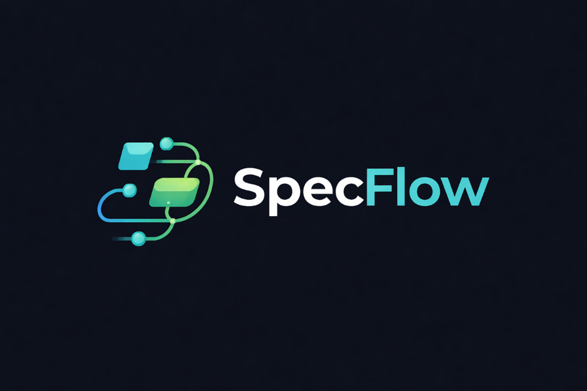

<!-- LOGO -->
<p align="center">
  
</p>

<h1 align="center">🚀 SpecFlow</h1>

<p align="center">
  A web-based platform for structured <b>software requirements management</b>
</p>

---

## 📚 Table of Contents

- [📌 Overview](#-overview)
- [🧠 Key Features](#-key-features)
- [👥 User Roles](#-user-roles)
- [🏗️ System Architecture](#️-system-architecture)
- [🔄 Core Functionality](#-core-functionality)
- [🖼️ Screenshots](#️-screenshots)
- [🛠️ Technologies Used](#️-technologies-used)
- [📈 Future Improvements](#-future-improvements)
- [👨‍💻 Team](#-team)
- [📄 License](#-license)

---

## 📌 Overview

**SpecFlow** is a web application designed for software development teams that struggle with **scattered and unstructured requirements**.

Instead of managing requirements across emails, documents, and notes, SpecFlow provides a **centralized and collaborative environment** where all requirements are organized and accessible.

---

## 🧠 Key Features

### 📂 Project Management
- Create and delete projects
- Assign ownership
- Share projects with other users

### 📋 Use Case Management
- Create, edit, and delete use cases
- Define:
  - Preconditions
  - Main flow
  - Alternative flows
  - Postconditions
- Approval workflow:
  - `PENDING`
  - `APPROVED`
  - `REJECTED`

### 🧩 CRC Cards
- Model system classes
- Define responsibilities & collaborations
- Link with Use Cases

### 💬 Collaboration
- Add comments to Use Cases & CRC Cards
- Enable team communication
- Role-based access control

### 📊 Diagram Generation
- Automatically generate:
  - Use Case Diagrams
  - Class Diagrams
- Export scripts compatible with:
  - PlantUML
  - Nomnoml

### 🔔 Notifications & History
- Track all changes (who & when)
- Notify users for:
  - approvals
  - comments
  - updates

---

## 👥 User Roles

- **Developer** → Creates and manages projects  
- **Collaborator** → Edits content  
- **Reviewer** → Adds comments only  
- **Organization Owner** → Approves/rejects requirements  
- **Admin** → Manages users and roles  

---

## 🏗️ System Architecture

The system follows a **domain-driven design approach**.

### Core Entities:
- `User`
- `Project`
- `UseCase`
- `Actor`
- `CRCCard`
- `Comment`
- `ProjectShare`

---

## 🔄 Core Functionality

Main system operations include:

- Create / Delete Project
- Create / Edit / Delete Use Case
- Create / Edit / Delete CRC Card
- Generate diagrams (PlantUML scripts)
- Share project with users
- Approve / Reject requirements
- Add / Delete comments

---

## 🖼️ Screenshots

```markdown

